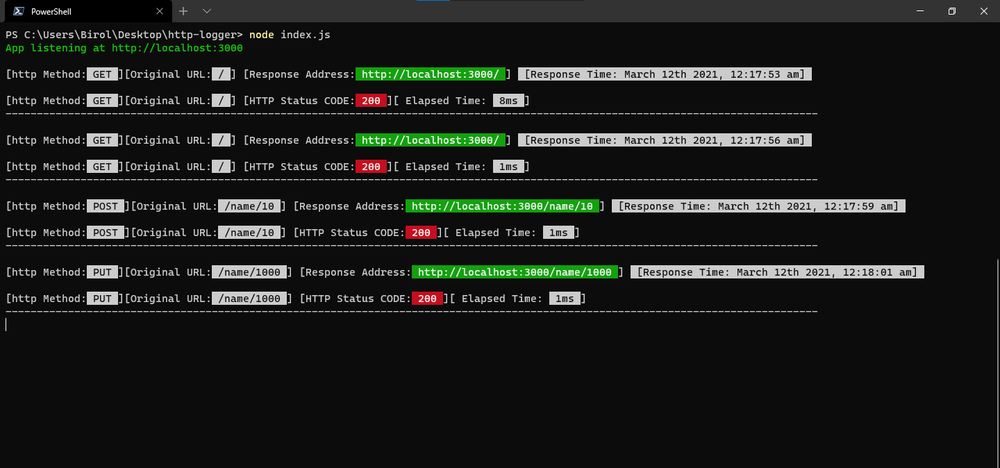

### http-logger
Colorful HTTP request logger middleware for Node.js

Clone to use and try with npm
```bash
	npm install
	npm run dev
```


- Displays HTTP methods, original url, response address, http status code, and time between request and response.

